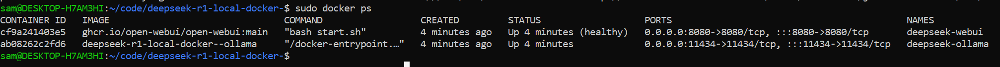
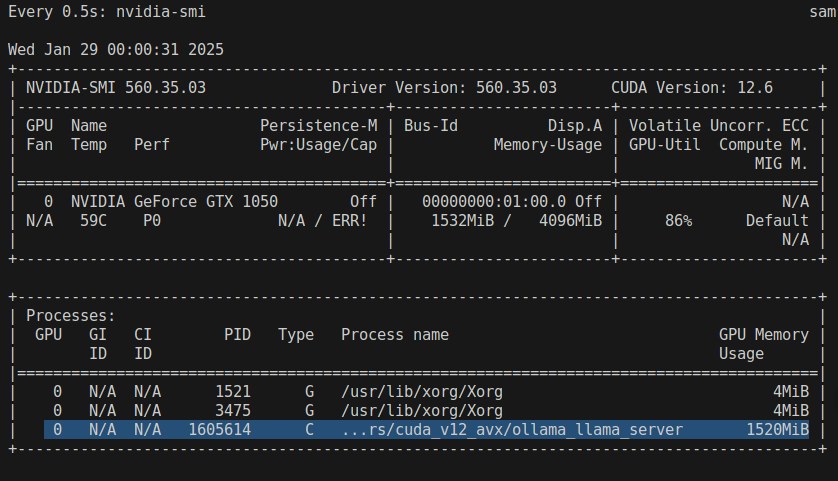
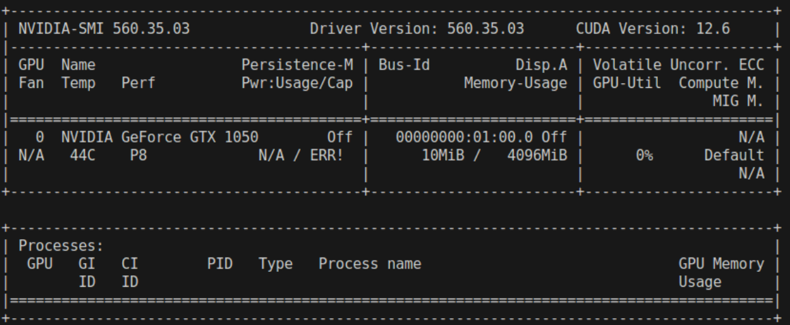
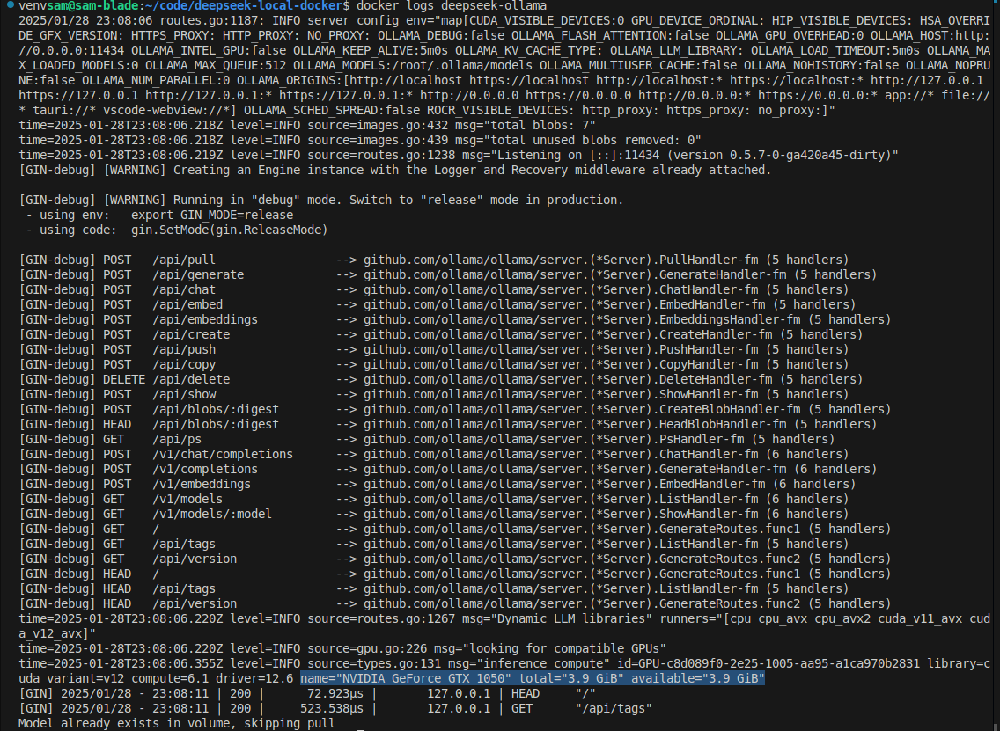

# Appendix

Extra information that doesn't fit in the main documentation.

## FAQ

### How do I see if the service is running?

Run `docker ps` on your host machine. You should see something like this:

### How do I check if the model is downloaded?

Run `docker logs -f deepseek-ollama` to see the progress of the model download.

### How do I determine if my GPU is being used?

#### Method 1

Run `make watch-gpu` on your host machine. Submit a prompt using the web ui or cli. You should see the processes as below:

If you see something like this, your GPU is being used:

#### Method 2

Run `docker logs deepseek-ollama` on your host machine. You should see:

