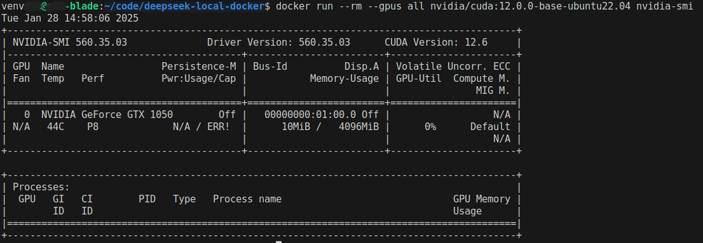

# Linux GPU Setup Guide

This guide covers setting up GPU support for DeepSeek R1 Local on Linux systems.

**Note:** Commands may need to be run with `sudo` if you are not in the docker group.

## Prerequisites

- NVIDIA GPU
- Updated NVIDIA drivers
- Docker and Docker Compose

## GPU Setup Steps

1. Install Docker and Docker Compose if not already installed:
```bash
make install-docker
```

2. Install NVIDIA Container Toolkit:
```bash
make setup-gpu
```
If successful, you should see something like the following, if not, see [Troubleshooting](#troubleshooting):



## Starting the Service

Start with GPU support:
```bash
docker compose -f docker-compose.yml -f docker-compose.gpu.yml up -d
```

## Troubleshooting

1. If you see "docker: Error response from daemon: could not select device driver":
   - Ensure NVIDIA Container Toolkit is properly installed
   - Restart the Docker daemon:
     ```bash
     sudo systemctl restart docker
     ```

2. If GPU is not detected:
   - Check NVIDIA driver installation:
     ```bash
     nvidia-smi
     ```
   - Verify NVIDIA Container Toolkit setup:
     ```bash
     sudo nvidia-ctk runtime configure --runtime=docker
     sudo systemctl restart docker
     ```
    - If you have docker installed via a snap, remove it and install it via apt:
    ```bash
    make install-docker
    ```
