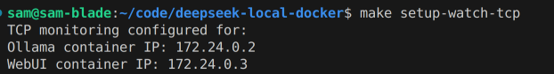
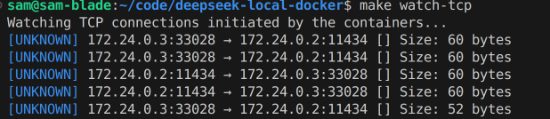
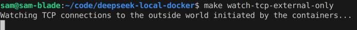

# Privacy and the CCP!

Many are, rightly or wrongly, concerned about the privacy implications of using the DeepSeek Chat model given it's origins in China. One of the motivations for this repository was to provide a way to use the model privately, without sending data to the cloud. Running locally of course doesn't preclude the possibility of data being sent to the cloud, but it does make it less likely. For those that want an extra level of reassurance, I've included some utility scripts to allow monitoring the TCP connections initiated by the containers.

## Monitoring TCP Connections

### Setup

To monitor the TCP connections initiated by the containers, run `make setup-watch-tcp`. This will setup the logging chain required for the monitoring to work.

### Watching the TCP connections

#### All TCP connections

To monitor the TCP connections initiated by the containers, run `make watch-tcp`. This will display the TCP connections in real-time, with color-coded output to indicate the direction of the connection.

These inter-container connections shown below are simply the webfront end talking to the ollama model and vice versa.

#### Only TCP connections to the outside world

To monitor only TCP connections to the outside world, which is what you want to look for to ensure that no data is being sent to the cloud, run `make watch-tcp-external-only`.

I've peresonally not witnessed any so far....

