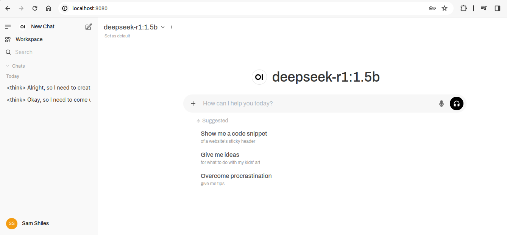
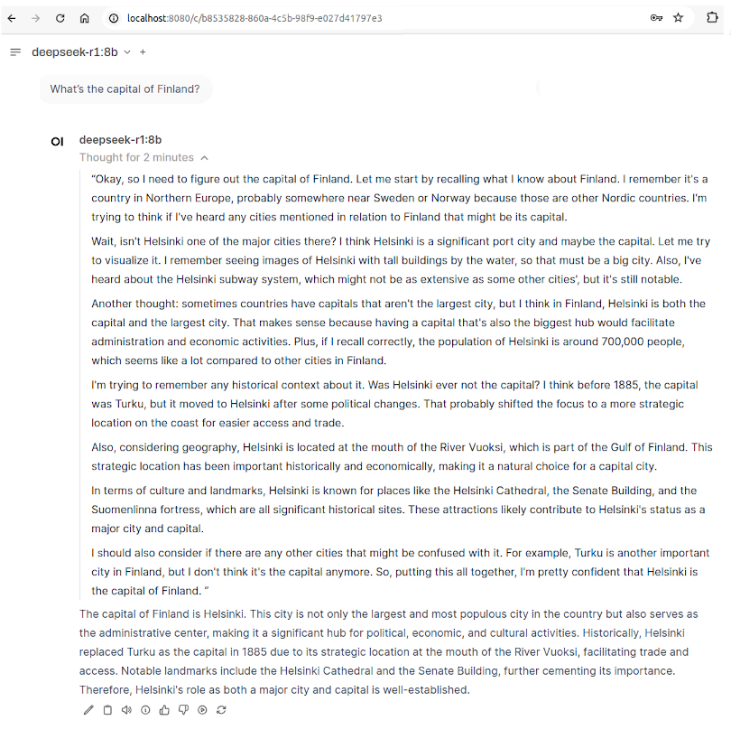
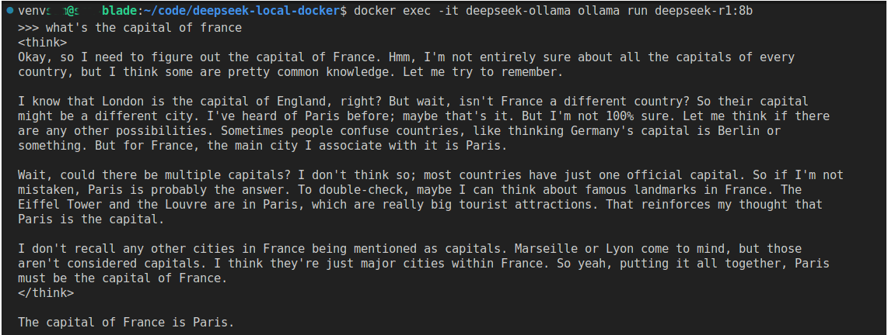

# DeepSeek R1 Local

This repository provides a dockerized environment for running DeepSeek R1 models locally via docker. You can interact with the model via browser using Open WebUI, via CLI using Ollama.

## Quick Start

1. Clone the repository
2. Run `docker compose up -d`
3. Point your browser to `http://localhost:8080`




## Setup


### Prerequisites

- Make (if running on Windows via WSL2 install using `sudo apt-get install make`)

- Docker and Docker Compose
- For GPU Support
  - NVIDIA GPU
  - Linux & Windows via WSL2:
    - NVIDIA Container Toolkit (see [available commands](#available-commands): `setup-gpu`)
  - Windows:
    - WSL2
    - Docker Desktop with WSL2 backend


### Setup Steps

1. GPU Setup (Optional but recommended)
   - If using GPU on Linux or on Windows via WSL2:
     1. Run the setup script:
        ```bash
        make setup-gpu
        ```
     2. Test GPU access:
        ```bash
        docker run --rm --gpus all nvidia/cuda:12.0.0-base-ubuntu22.04 nvidia-smi
        ```
2. Start the containers:

   **Linux with GPU:**
   ```bash
   docker compose -f docker-compose.yml -f docker-compose.linux.yml up -d
   ```

   **macOS with GPU (Metal):**
   ```bash
   docker compose -f docker-compose.yml -f docker-compose.mac.yml up -d
   ```

   **CPU Only / Windows (native, simplest but slowest):**
   ```bash
   docker compose up -d
   ```

    **Windows (with GPU, WSL2):**

   See [Additional Notes for Windows Users](#additional-notes-for-windows-users)


3. Access the Web UI at: `http://localhost:8080`

**Note:** The first startup may take quite a long time as it downloads the model (1.1GB for the default 1.5bn model). The model will be stored in a Docker volume (`ollama-models`) and persisted between container restarts so this is a one-time cost.

#### Additional Notes for Windows Users

- WSL2 is only required if you want GPU acceleration
- For CPU-only usage, you can run directly on Windows with Docker Desktop
- Performance may be better with WSL2, even for CPU-only workloads

1. **WSL2 (Recommended for GPU support)**
   - Requires WSL2, NVIDIA CUDA drivers, and Docker Desktop with WSL2 backend
   ```bash
   docker compose -f docker-compose.yml -f docker-compose.windows.yml up -d
   ```

2. **Native Windows (CPU-only)**
   - Install Docker Desktop for Windows
   - No WSL2 required
   ```bash
   docker compose up -d
   ```


## Talking to the LLM

### Web UI:
Just point your browser to `http://localhost:8080`

  

### CLI Interactive Terminal:
  ```bash
  docker exec -it deepseek-ollama ollama run deepseek-r1:1.5b
  ```

  

## Using Different Model/Parameter Sizes

By default the 1.5bn parameter model pulled and used locally. This is the smallest model and will get you up and running most quickly. You may find that the 7bn or 8bn parameter models offer a better balance of quality and speed however.

Full list of models/param counts can be found at [r1 versions](https://ollama.com/library/deepseek-r1).

To use a different model size, you can:


1. Stop the containers: `docker compose down`
2. Set the MODEL_SIZE environment variable: `export MODEL_SIZE=14b`
3. Restart: `docker compose up -d`

Or modify the model size in docker-compose.yml directly.


### Notes on parameters

Before you get excited and decided to pull the 671bn parameter model, it's very unlikely that you'll have a machine capable of running this or the other larger models.

Rough minimum requirements:


| Parameters | RAM Required | GPU(s) | Storage | CPU | PSU | Model Size |
|------------|-------------|---------|----------|-----|-----|------------|
| 1.5B | 8GB | 1x RTX 3060 (12GB) | 16GB NVMe | 6+ core CPU | 650W | 1.1GB |
| 7B | 16GB | 1x RTX 4070 Ti (16GB) | 32GB NVMe | 8+ core CPU | 750W | 4.7GB |
| 8B | 20GB | 1x RTX 4080 (16GB) | 40GB NVMe | 8+ core CPU | 850W | 4.9GB |
| 14B | 32GB | 1x RTX 4090 (24GB) or 2x 4080 | 64GB NVMe | 12+ core CPU | 1000W | 9GB |
| 32B | 64GB | 2x RTX 4090 or 1x A6000 (48GB) | 128GB NVMe | 16+ core CPU | 1200W | 20GB |
| 70B | 160GB | 2-3x A6000 or 2x A100 (80GB) | 256GB NVMe | 32+ core CPU | 1500W | 43GB |
| 671B | 1.5-2TB | 8+ H100s (80GB) | 2-3TB NVMe | 64+ core CPU (EPYC/Xeon) | 2-3kW | 404GB |


